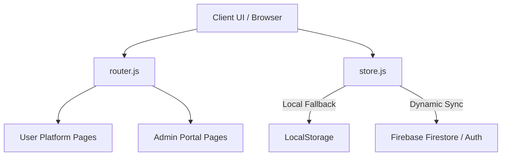

# Sree VK Enterprises — Web Application Overview

Sree VK Enterprises is a B2B clinical catalog and order requisition portal designed for pharmacies, hospitals, and procurement managers to showcase, request, and manage surgical items, consumables, diagnostic systems, and lab equipment.

---

## 🏗️ System Architecture

The application is built using a modern **Single Page Application (SPA)** architecture without complex heavy framework dependencies, ensuring high performance, responsive navigation, and direct synchronization with **Firebase Firestore**.

- **Core**: HTML5, Vanilla JavaScript, and dynamic template rendering.
- **Styling**: Modern, premium Vanilla CSS styling system using global custom tokens, glassmorphism, responsive grids, and customized transitions.
- **Routing**: Client-side hash routing (`#/path`) with automatic page lifecycle events mapping.
- **Database / Sync**: Google Firebase Firestore integration with active state sync and local caching mechanisms.

---

## 📦 Components Directory (`src/components/`)

These modular UI units are reused across the guest, client-facing, and administrative views to keep design patterns consistent and maintainable:

| Component | File Link | Description |
| :--- | :--- | :--- |
| **Topbar** | [Topbar.js](file:///Users/madhusammetla/Desktop/VK%20enterprises/src/components/Topbar.js) | Global persistent header showing logo, responsive hamburger navigation, global search, and cart unit badges. |
| **Sidebar** | [Sidebar.js](file:///Users/madhusammetla/Desktop/VK%20enterprises/src/components/Sidebar.js) | Dynamic drawer slide-out menu showing user profiles, quick routes, administrative links, and logouts. |
| **ProductCard** | [ProductCard.js](file:///Users/madhusammetla/Desktop/VK%20enterprises/src/components/ProductCard.js) | Clean catalog card listing Category, SKU, Description, Stock Status (In Stock, Low Stock, On Order, Out of Stock), and a full-width requisition button. |
| **CartItem** | [CartItem.js](file:///Users/madhusammetla/Desktop/VK%20enterprises/src/components/CartItem.js) | Reusable item row for the cart showing details, photo thumbnail, SKU, interactive counter, and a removal button. |
| **OrderRow** | [OrderRow.js](file:///Users/madhusammetla/Desktop/VK%20enterprises/src/components/OrderRow.js) | Summary table row detailing Requisition ID, contact info, item count, date, and status badges. |
| **QuantityCounter** | [QuantityCounter.js](file:///Users/madhusammetla/Desktop/VK%20enterprises/src/components/QuantityCounter.js) | Plus/minus incremental component with event listeners managing quantities in details and cart. |
| **CategoryTabs** | [CategoryTabs.js](file:///Users/madhusammetla/Desktop/VK%20enterprises/src/components/CategoryTabs.js) | Interactive filter pill row showing dynamic item counts in each category. |
| **StatusBadge** | [StatusBadge.js](file:///Users/madhusammetla/Desktop/VK%20enterprises/src/components/StatusBadge.js) | Formatted clinical badges representing state values for both stock levels and requisition orders. |
| **Modal** | [Modal.js](file:///Users/madhusammetla/Desktop/VK%20enterprises/src/components/Modal.js) | Portal popup dialog used for admin confirmations, creating inventory, and editing details. |
| **Toast** | [Toast.js](file:///Users/madhusammetla/Desktop/VK%20enterprises/src/components/Toast.js) | Clean pop-up message notifier supporting clinical color states (success, error, info). |
| **Loader** | [Loader.js](file:///Users/madhusammetla/Desktop/VK%20enterprises/src/components/Loader.js) | Circular page-load spinner and inline spinners for async Firestore operations. |
| **Pagination** | [Pagination.js](file:///Users/madhusammetla/Desktop/VK%20enterprises/src/components/Pagination.js) | Pagination controllers mapping catalog items by pages. |

---

## 🖥️ Application Pages (`src/pages/`)

### 👥 Client & Guest Platform

1. **Home/About Page ([HomePage.js](file:///Users/madhusammetla/Desktop/VK%20enterprises/src/pages/HomePage.js))**
   - Introduces VK Enterprises, surgical products catalog, serving regions, corporate achievements, and physical branch coordinate details.
2. **Products Catalog Page ([ProductsPage.js](file:///Users/madhusammetla/Desktop/VK%20enterprises/src/pages/ProductsPage.js))**
   - Interactive medical catalog directory showing paginated cards, categorized tabs, and a fast SKU/name matching filter.
3. **Product Detail Page ([ProductDetailPage.js](file:///Users/madhusammetla/Desktop/VK%20enterprises/src/pages/ProductDetailPage.js))**
   - Detailed specification sheets for selected items, multi-image galleries, and requisition quantities additions.
4. **Login & Registration ([LoginPage.js](file:///Users/madhusammetla/Desktop/VK%20enterprises/src/pages/LoginPage.js))**
   - Gatekeepers for B2B accounts. Includes dedicated buttons for quick testing logins: **Hospital User** and **VK Staff Admin**.
5. **Requisition Cart Page ([CartPage.js](file:///Users/madhusammetla/Desktop/VK%20enterprises/src/pages/CartPage.js))**
   - Review panel for requisition requests detailing total items, distinct category selections, and submission triggers.
6. **Requisition List Page ([RequestsPage.js](file:///Users/madhusammetla/Desktop/VK%20enterprises/src/pages/RequestsPage.js))**
   - User ledger showing all historical submissions filterable by status (Pending, Accepted, Dispatched, Delivered, Rejected).
7. **Requisition Detail Page ([RequestDetailPage.js](file:///Users/madhusammetla/Desktop/VK%20enterprises/src/pages/RequestDetailPage.js))**
   - Interactive tracking timeline showing real-time updates and notes from VK Enterprises dispatch agents.

---

### 🛡️ Admin Portal (VK Enterprises Staff)

1. **Incoming Requisitions Queue ([AdminOrdersPage.js](file:///Users/madhusammetla/Desktop/VK%20enterprises/src/pages/AdminOrdersPage.js))**
   - Administrative command center summarizing client requests, order units, submission dates, and status codes.
2. **Requisition Management Screen ([AdminOrderDetailPage.js](file:///Users/madhusammetla/Desktop/VK%20enterprises/src/pages/AdminOrderDetailPage.js))**
   - Panel to view client procurement contacts, approve/reject orders, input shipping tracking numbers (e.g. Courier & Tracking No), and log remarks.
3. **Inventory Catalog Manager ([ManageProductsPage.js](file:///Users/madhusammetla/Desktop/VK%20enterprises/src/pages/ManageProductsPage.js))**
   - High-density admin console to create new surgical inventory, search SKUs, edit existing descriptions/photos, and delete items from Firestore.

---

## ⚡ Global Core & State Control

- **State Container ([store.js](file:///Users/madhusammetla/Desktop/VK%20enterprises/src/store.js))**
  - Keeps trace of `user` authentication data, active shopping `cart` items, user `orders` history, and `products` lists.
  - Automatically coordinates CRUD actions with Firebase Firestore when network links are established, falling back safely to local browser storage caches.
- **Routing Engine ([router.js](file:///Users/madhusammetla/Desktop/VK%20enterprises/src/router.js))**
  - Dynamically mounts relevant page layouts and hooks up appropriate click listeners to prevent page refreshes.
- **Firebase Configuration ([firebase.js](file:///Users/madhusammetla/Desktop/VK%20enterprises/src/firebase.js))**
  - Connects to Firestore instances, exposing stateful connection indicators.
- **Database Seeder ([seed.js](file:///Users/madhusammetla/Desktop/VK%20enterprises/src/utils/seed.js))**
  - A developer utility script exposed on the `window` object to wipe clean and seed Firestore with custom products lists.
- **Formatting Helpers ([helpers.js](file:///Users/madhusammetla/Desktop/VK%20enterprises/src/utils/helpers.js))**
  - Modular time formatters, order ID generators, and string filters.
