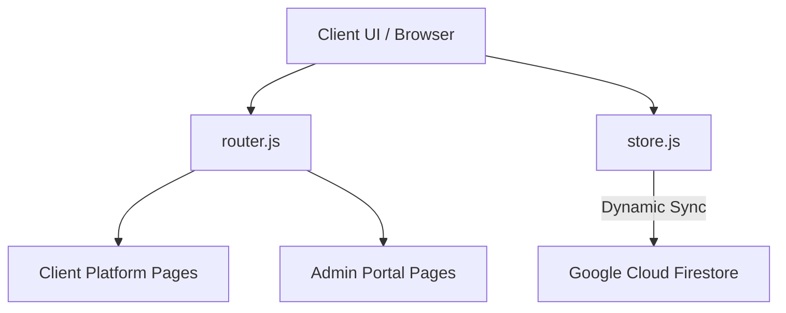

# Sree VK Enterprises — Clinical Catalog & Requisition Portal

Sree VK Enterprises is a premium B2B medical supply catalog and quote requisition portal designed for pharmacies, hospitals, and medical procurement managers. The system enables users to view diagnostic systems, surgical consumables, and lab equipment, build quote requests, and track their procurement pipeline. It also provides a robust administrative portal for VK Enterprises staff to manage incoming requisitions, updates tracking logistics, and control product inventories.

---

## 🏗️ System Architecture

The application is built as a lightweight, high-performance **Single Page Application (SPA)** that avoids bulky frameworks, relying on a reactive state store and hash-based routing.



---

## 🛠️ Tech Stack & Technologies

1. **Core Architecture**:
   - **Vanilla JavaScript & HTML5**: Custom reactive state management and dynamic template rendering.
   - **SPA Hash Router**: Custom client-side router (`router.js`) managing hash routes (`#/path`) with navigation guards.
2. **Styling & Design System**:
   - **Modern CSS (CSS3)**: Vanilla CSS layout engine using global design tokens, HSL color palettes, Glassmorphism, smooth animations, and a fully responsive grid.
   - **Material Icons**: Standardized clinical UI iconography.
3. **Database & Persistence**:
   - **Google Firebase (Firestore)**: Cloud database storing user accounts, cart configurations, product catalogs, and quote requisitions.
   - **Real-Time Data Merging**: Automatic synchronization of offline local data to Firestore upon login.
4. **Development & Bundling**:
   - **Vite**: Rapid hot-reloading development server and production bundle compiler.

---

## 📦 Key Features

### 👥 Client & Guest Platform
- **Medical Supply Catalog**: Category tab filters, real-time search, and pagination.
- **Product Specifications**: High-density detail sheets containing SKU, category, stock status, and custom spec grids.
- **Quote Basket**: Dynamic checkout cart where clients adjust requisition quantities before submitting.
- **Order Tracking**: Requisition ledger showing order history with interactive timelines detailing dispatch statuses (Pending, Approved, Dispatched, Delivered, Rejected).

### 🛡️ Admin Portal (VK Staff)
- **Requisitions Dashboard**: Queue showing all client requests sorted by date and filterable by status.
- **Order Management Screen**: Interface to approve/reject orders, input shipping tracking numbers, and add agent remarks.
- **Inventory Manager**: High-density catalog manager to create new inventory items, edit specifications, delete items, and sync changes instantly to Firestore.

---

## 🚀 Local Installation & Run Guide

### 1. Prerequisites
Ensure you have [Node.js](https://nodejs.org/) installed on your machine.

### 2. Install Dependencies
```bash
npm install
```

### 3. Configure Environment Variables
Create a file named `.env` in the root of the project directory and populate it with your Firebase project credentials (see `.env.example` as a template):
```env
VITE_FIREBASE_API_KEY=your_api_key
VITE_FIREBASE_AUTH_DOMAIN=your_project_id.firebaseapp.com
VITE_FIREBASE_PROJECT_ID=your_project_id
VITE_FIREBASE_STORAGE_BUCKET=your_project_id.firebasestorage.app
VITE_FIREBASE_MESSAGING_SENDER_ID=your_messaging_sender_id
VITE_FIREBASE_APP_ID=your_app_id
```

### 4. Run the Dev Server
```bash
npm run dev
```
Open the local URL displayed in the terminal (typically `http://localhost:5173/` or `http://localhost:5174/`).

### 5. Build for Production
```bash
npm run build
```

---

## 🔒 Firestore Security Rules Setup
Configure these rules in the **Rules** tab of your Firestore Database in the Firebase Console:

```javascript
rules_version = '2';
service cloud.firestore {
  match /databases/{database}/documents {
    // Products Catalog
    match /products/{productId} {
      allow read, write: if true;
    }
    // Requisitions
    match /orders/{orderId} {
      allow read, write: if true;
    }
    // User Accounts
    match /users/{userId} {
      allow read, write: if true;
    }
    // Carts
    match /carts/{userId} {
      allow read, write: if true;
    }
  }
}
```

---

## 🔄 Data Migration & Seeding Details
- **Auto-Seeding**: When the application runs with an active Firebase database, it checks if the `products` collection is empty. If it is, it automatically populates Firestore with the complete clinical catalog of medical supplies.
- **Local Data Merge**: Any products added by you while offline are automatically migrated from local storage cache to Firestore upon your next page load or registration.
